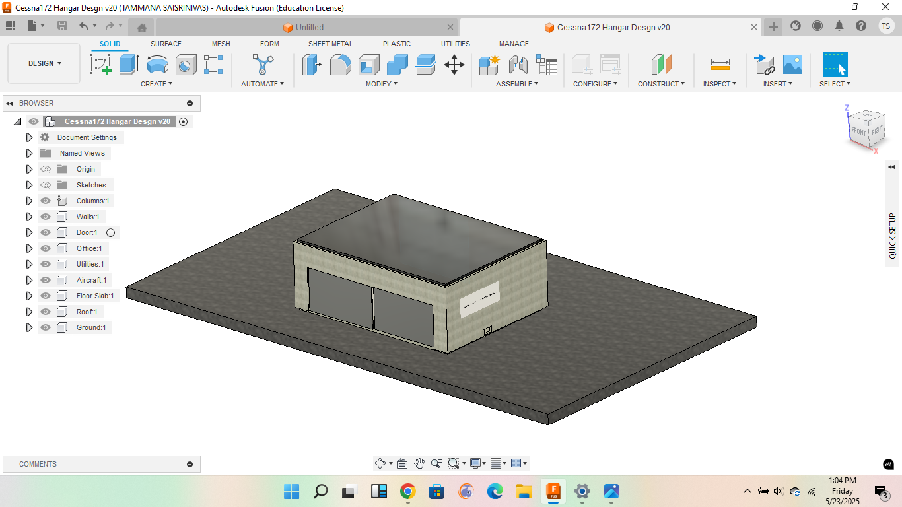

# Fusion360_Designs
A collection of 3D CAD models and engineering designs made using Autodesk Fusion 360.

This repository showcases my self-created 3D models in Fusion 360, built for practice and skill development across various design concepts.

## 🏗️ Models
### 1. Crane Stress Analysis
- **📷 Final Result Media:**
- 
